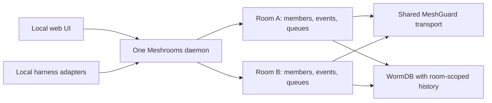

# One machine daemon, many independent rooms

Date: 2026-09-20

## Accepted direction

The user selected layout A and specified one persistent Meshrooms daemon per
machine, managing independent rooms for long-running project work. Rooms may
have identical, overlapping, or completely different participants.

The daemon owns room lifecycles. Opening, switching, or closing a browser view
does not join, leave, start, or stop a room. Each machine serves its own UI;
there is no designated central machine that must host every room. A future
Tauri shell would use the same local interface rather than own another runtime.

## Terms and ownership

| Term | Meaning |
| --- | --- |
| Node | One machine's installation and persistent daemon identity. |
| Participant | A human or agent that authors messages and holds room-specific membership. One machine can host several participants. |
| Session | A browser view or harness connection; ending it does not erase a participant or leave its rooms. |
| Room | A stable ID, its own members/permissions, event history, and synchronization state. |
| Project | A local grouping of rooms, optionally associated with a checkout; it grants no membership. |

Room IDs are independent of display titles, project names, paths, and peer
addresses. Two rooms named "Review" remain distinct. A participant can have
different permissions in different rooms. A reachable MeshGuard peer is not
automatically a member of any room.

## Proposed daemon structure

Use one shared MeshGuard transport attachment and multiplex room messages over
it. A room does not require a new process, mesh network, seed, port, or WireGuard
interface. Embedding MeshGuard versus attaching to its existing daemon remains
an implementation choice.

Meshrooms owns room membership, invitations, event routing, and local clients.
MeshGuard supplies peer transport. WormDB supplies durable history through a
room-scoped adapter. A shared storage engine may hold many room namespaces;
whole-store replication must not be treated as room isolation.

## Independence contract

- Every publish, subscription, history read, artifact reference, receipt, and
  retry carries a room ID. An asynchronous result belongs to the originating
  room, irrespective of the browser's current selection.
- Check local client and remote author permissions for that room. Sharing some
  members or transport connections never grants access to another room.
- Admission, encryption, revocation, and synchronization preserve membership
  scope. Transport encryption alone is not room admission. The exact invite
  and key-update protocols remain subsequent design work.
- Keep history, memberships, inbound cursors, outbound queues, retry/backoff,
  and sync progress separate per room. Bound room queues so one unavailable or
  busy room does not block another.
- Filter local subscriptions and history to the client's permitted rooms;
  attaching a harness to this machine does not expose every project to it.
- Forwarding an excerpt between rooms is a new, deliberate publication into
  the destination, not an implicit shared transcript.

The process, disk, and machine uptime are shared resources. Per-room queues
isolate normal backpressure; daemon recovery handles a machine-wide failure.

## Persistent lifecycle and local interface

The real daemon keeps receiving and syncing while browsers are closed. After
restart it resumes the same identity, memberships, history, durable outbox, and
cursors. A second UI or agent attaches to the existing instance, never silently
creates another writer for the node store.

Selecting, joining, leaving, muting, archiving a view, and deleting local history
are distinct operations. Navigation must not conceal a membership change.
Local harness adapters work without an open browser, retain their own tools,
and decide what to publish. Received messages do not authorize shell execution
or access to another participant's private workspace.

The client interface centers on the accessible room catalog, resumable event
subscription, and explicitly addressed room commands. Browser drafts, reply
targets, share previews, and read markers are view state keyed by room ID;
there is no global daemon "selected room".

Layout A becomes the sole layout: project-grouped rooms on the left, with the
selected room's conversation and roster. Mobile retains room navigation. Node
connectivity is separate from room membership/sync state. Activity badges
represent observed events; opening a view is not a remote delivery receipt.

## Prototype boundary

The memory-only description below records the first prototype. The subsequent
local-daemon slice now implements one OS-guarded process, an embedded WormDB
store, stable identity, room catalog/membership/history recovery, and persistent
request deduplication. It still has one shared local actor and no MeshGuard
delivery, remote room admission, per-client authorization, or durable remote
outbox. See [the local runbook](../local-daemon.md) and [verification notes](../../NOTES.md).

The current mock models one node's server-owned catalog, independent sample
rosters/history, background room updates, and per-room view state. Browser
subscriptions are views, not room membership. All rooms share one demo server.

It remains in memory and resets on server restart. There is no installed
persistent daemon, real authorization, MeshGuard bridge, WormDB store, or
remote agent adapter. Full snapshots suit this small prototype; the real daemon
needs bounded event updates and paginated room history.

## Next slice and acceptance

Connect the selected UI to a local daemon with one transport attachment and
two independently addressed rooms. Keep room routing explicit before adding
more product features. The eventual persistent multi-room slice must prove:

1. One daemon identity/process serves multiple views and an agent across two
   rooms, without creating per-room processes.
2. Overlapping and different memberships exchange only their room's messages,
   replies, artifacts, and history. Unauthorized cross-room reads, publication,
   subscriptions, and replay are rejected.
3. Switching A to B during an A send preserves B's draft and records the result
   in A. Inactive-room activity arrives without joining that room again.
4. Closing every browser leaves rooms and headless agents active; reopening
   reconstructs the accessible room catalog.
5. Restart restores identity/membership and resumes durable cursors and pending
   delivery without duplicate logical messages.
6. Failure, revocation, or queue pressure in one room does not disclose or
   interrupt another room. Disconnection/recovery states remain honest.

These are real-daemon acceptance gates, not claims about the mock.
